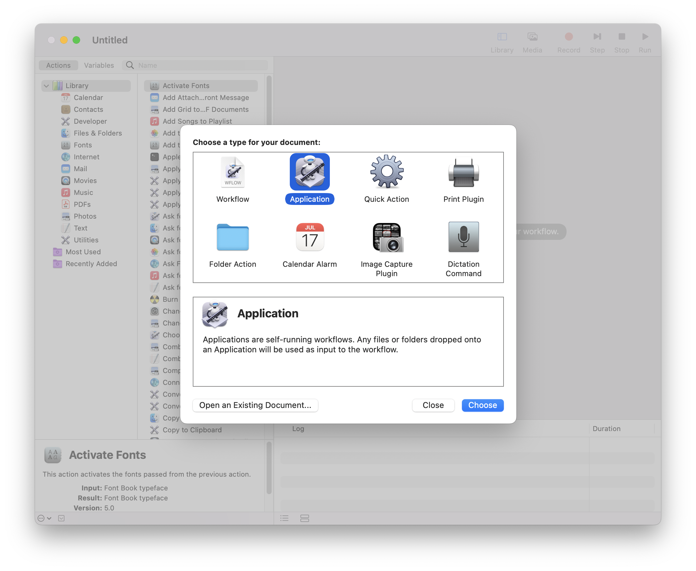
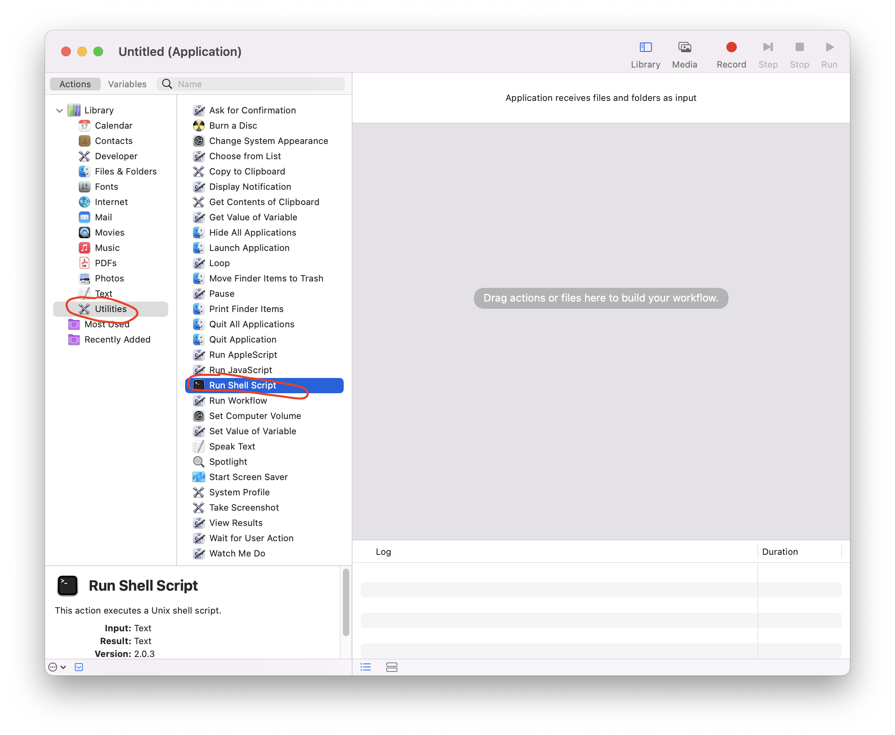
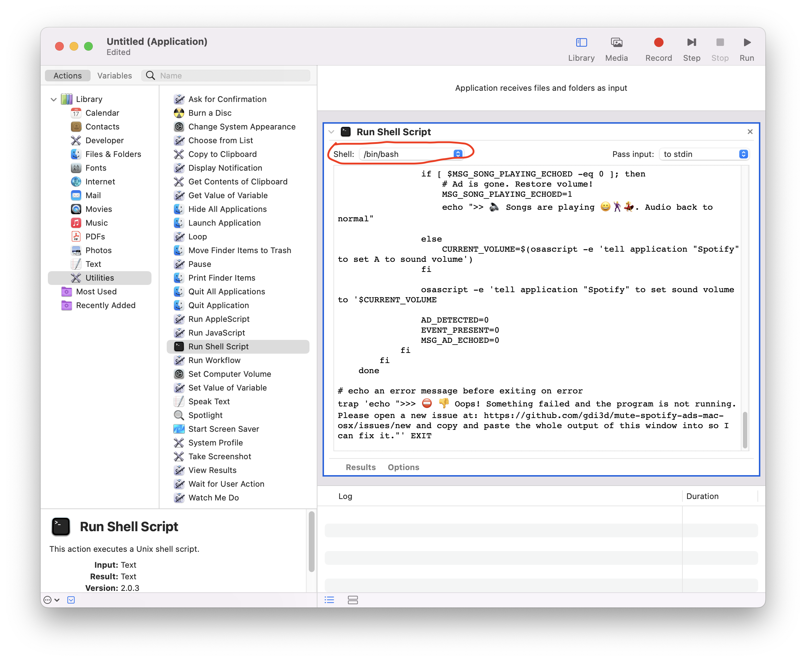
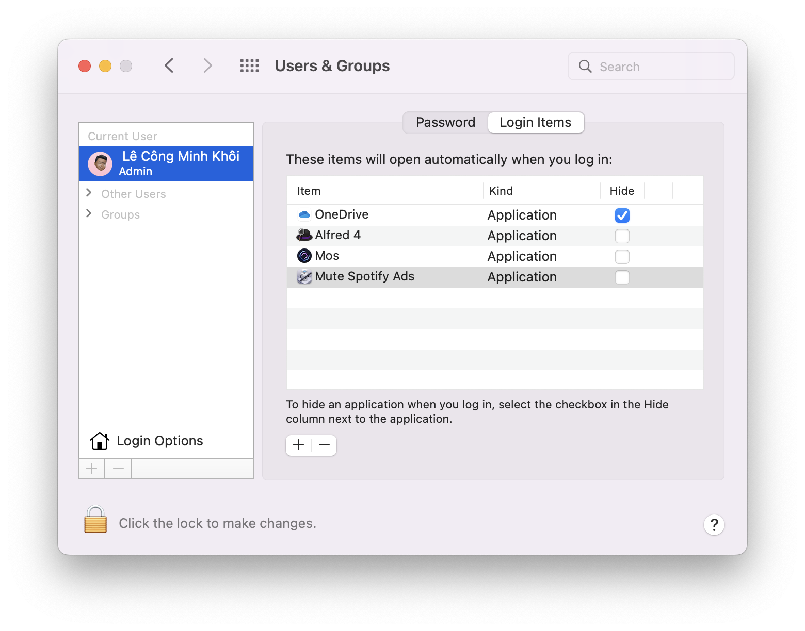

# Automatically mute Spotify Ads

I hate listening to Spotify Ads. This small script detects when Ads gets loaded and lowers the system audio way down until a song it's loaded again.

## How to install and use

<https://gdi3d.github.io/mute-spotify-ads-mac-osx/>

## Auto run on startup

Open `Automator` on your Mac machine and choose `Application`

From `Utilities` choose `Run Shell Script`

Choose `/bin/bash` from `Shell` selection, then copy all the code from `NoAdsSpotify.sh` and paste it into the `Script` field.

Open `System Preferences` -> `Users & Groups` -> `Login Items` and add the saved script to the `Startup` list.

After that, whenever you log in to your Mac, your Spotify will be automatically muted when an Ad gets loaded.
